# 🏗️ Setting up `SQL Server 2019` AlwaysOn Availability Group Clusters on a Multi-Subnet Network with a Domain

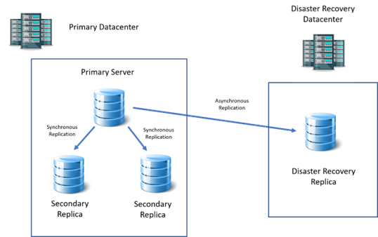

---

## 📅 Document Dates

| Created | 02/23/2023 |
|---------|------------|
| Last Updated | 01/13/2025 |

---

## 1. Foreword 📖

* Sometimes you might need to set up a cluster which spans multiple subnets and separate VLANs. The nodes in this cluster need to communicate using intermediary routing devices. A single datacenter can have multiple subnets. A multi-subnet AlwaysOn cluster is recommended for replicas that are situated in the same datacenter with strong and stable network connection.  
* However, please note that if your multi-subnet cluster should span over a cross-datacenter architecture with separate geolocations for disaster recovery purposes, a **Distributed Availability Group (`DAG`)** is a better solution and has some advantages over traditional AlwaysOn clusters.  
* Also, as another remedy, you can create a virtual network on top of physically separated LANs using `SDN` solutions with only one subnet. This way, the AlwaysOn cluster can be created on an ordinary single-subnet network.

---

## 2. Preliminaries and Prerequisites ✅

* This document uses `Windows Server 2019` and `SQL Server 2019`. Later, it was tested on `Windows Server 2025` and `SQL Server 2022`.
* This document assumes that you have full control over your domain, servers, and network. If you do not, you have to refer to respective infrastructure teams for your environment.
* The full process for creating a SQL Server Availability Group is not explained here—only the difference between single-subnet and multi-subnet Availability Group setup is mentioned. For single-subnet details please refer to online materials.

---

## 3. Test Case Specific IP Addresses 🌐

Below are the IP addresses used for the test case:

### 3.1 Core Servers

| Role  | IP Address        |
|-------|-------------------|
| DC    | 192.168.241.240   |
| Node1 | 192.168.241.111   |
| Node2 | 192.168.241.112   |
| Node3 (Secondary Subnet) | 10.10.10.113 |

### 3.2 Cluster & Listener

| Type        | IP Addresses (Multi-Subnet) |
|-------------|-----------------------------|
| Cluster     | 192.168.241.114 & 10.10.10.114 |
| Listener    | 192.168.241.115 & 10.10.10.115 |

### 3.3 Routers (Gateways Between Subnets)

| Subnet | Gateway IP |
|--------|------------|
| 192.168.241.x | 192.168.241.2 |
| 10.10.10.x    | 10.10.10.1    |

---

## 4. Port Requirements 🔌

Aside from mandatory `TCP` ports for SQL Server service (`1433` and `1434` for default instance) and endpoints (usually `5022`), the port `3343` is required for the cluster. You need to make sure it is reachable from every node to every other node.

> No extra services or applications are installed on these VMs except `OpenSSH` (not mandatory). Only necessary applications were installed from raw Windows Server installation.

Here is a list of open listening TCP ports on the nodes that are not present on a raw Windows Server 2019 computer on a domain:

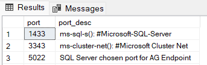

Having these extra ports is recommended when setting up the Availability Group Cluster.

* `5357` → **Web Services on Devices (WSD) API**
* `5985` → **WinRM / PowerShell remoting (HTTP)**
* `9389` → **Active Directory Web Services (ADWS)**

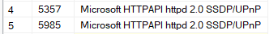

---

## 5. List of Test Case Open Listening Ports in Detail 📊

Here is a major list of listening ports (apart from dynamic ports) in the test case on different servers.

| Server | Notes |
|--------|-------|
| DC     | Screenshot below |

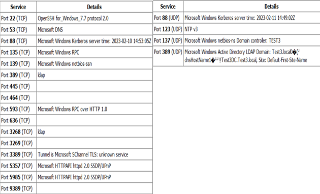

Simple raw Windows Server ports:

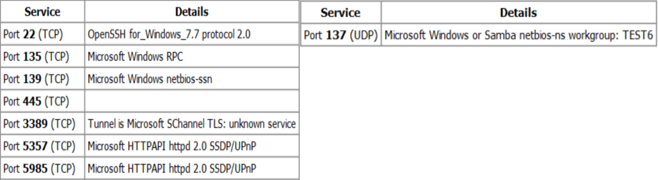

> For the `5985` or `5986` ports to be listening, PowerShell Remoting over HTTP or HTTPS must be enabled.

The UDP ports serve the same subnet.

The intersection (`intersect`) of Node1, Node2, and Node3 listening TCP ports:

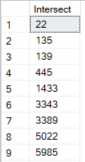

> Note: Port `22` is for `OpenSSH` and is NOT mandatory; port `5022` is the chosen SQL Server endpoint port.

If you have malfunctions in your cluster/AG, you can use a port scanner to see which ports are active and responding.

---

## 6. Joining a Different Subnet Server to the Domain 🔁

Make sure that your `DNS` and `Active Directory` services have the required configurations. A sample of the DNS Server's IP configuration:

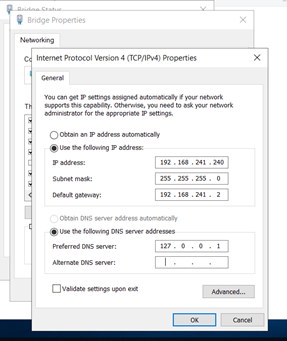

The gateway must be a router’s IP on your LAN which routes your server to the second subnet.

### 6.1 Steps in DNS Manager 🛠️

1. Go to `DNS Manager`.
2. Right-click on `Reverse Lookup Zones` → click `New Zone`.

   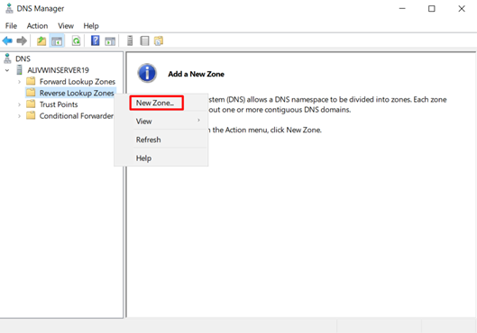
   
   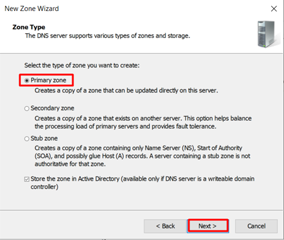
   
3. Choose the preferred zone type.

   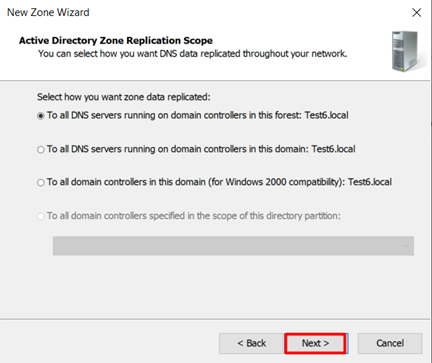
   
4. Choose the secondary subnet IP version and click `Next`.

   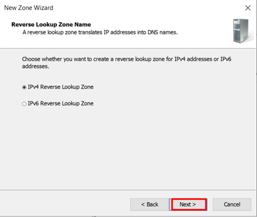
   
5. Enter `Network ID` and click `Next`.

   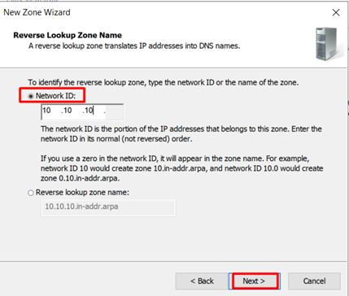
   
6. Follow wizard screens:

   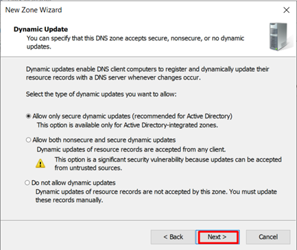
   
   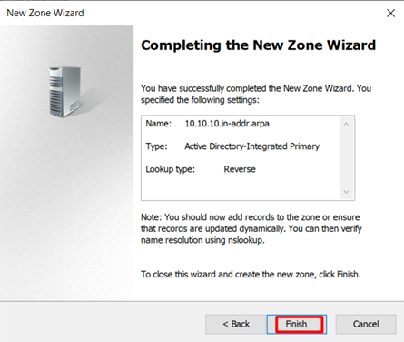
   
   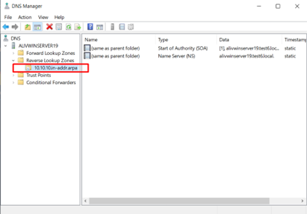
   
7. Sample IPv4 address configuration on 2 nodes (DNS server specification is important for joining the domain and finding the domain controller):
   
   
   
   a. Same subnet:  
   
   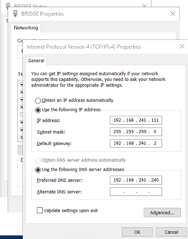  
   
   b. Secondary subnet:  
   
   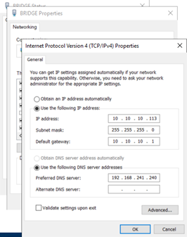
   
8. Continue with reverse zone completion:

   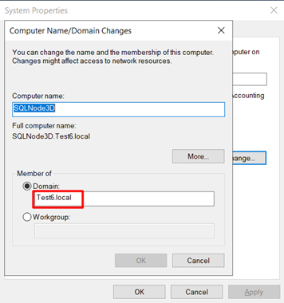

### 6.2 Summary for Adding a Secondary Subnet Server to the Domain 📝

Joining servers on the same subnet as the domain controller is easy. For a multi-subnet network:

* You must manually add the secondary subnet reverse zones to the DNS server.
* Servers (same or secondary subnet) must define a DNS server capable of resolving the domain name.
* If you get an error that the specified domain cannot be contacted, common causes include:
  - Missing DNS server configuration.
  - Try entering the `Root domain name` or `FQDN` (NetBIOS might not resolve otherwise).
* If you get a SID error during domain join, you have improperly cloned your VM. Run `Sysprep` to fix this.

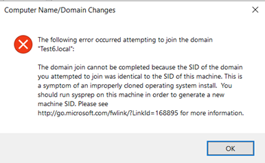

---

## 7. Setting Up Multi-Subnet SQL Server 2019 AlwaysOn HA 🧩

### 7.1 Brief Steps

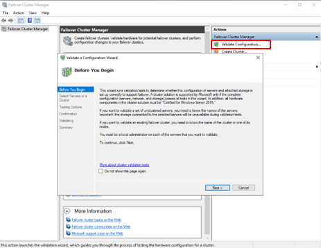

| Nodes (Example) |
|-----------------|
| **192.168.241.111** |
| **192.168.241.112** |
| **10.10.10.113**    |

3. Cluster validation wizard steps:  

   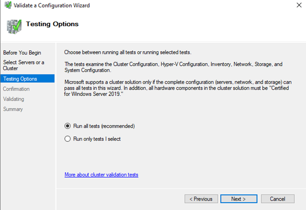
   
4. Validation reports:  

   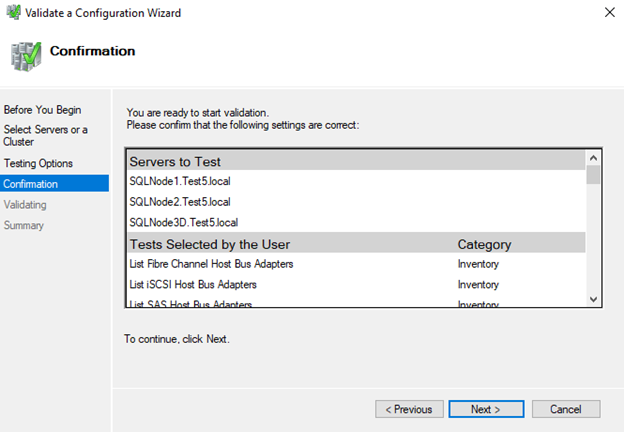
   
5. Network configuration checks:  

   
   
6. Node validation summary:  

   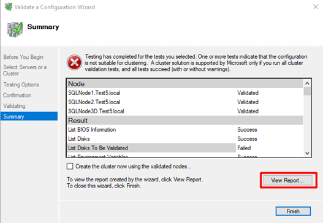

A warning shows up:

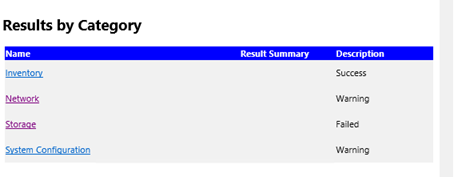

Storage validation is unimportant right now:

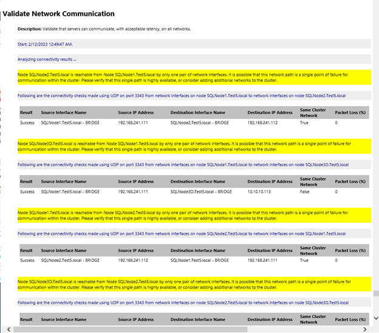

> This warning strongly recommends that the link between nodes is highly available and fault tolerant. Disregarded for the test case.

7. Continue wizard:  

   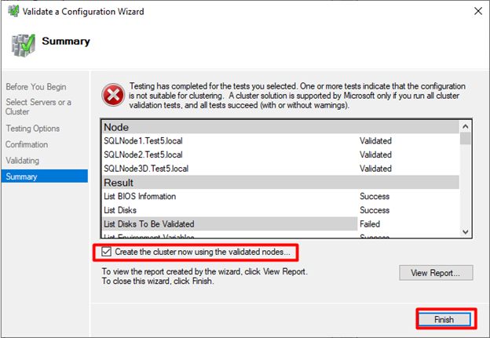
   
8. Entering cluster IP addresses for both subnets. Windows Failover Cluster’s `Create Cluster Wizard` automatically detects multi-subnet based on nodes.
   
   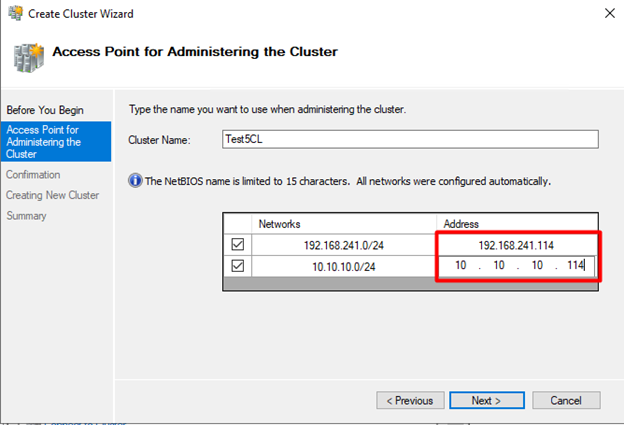

If multiple subnets exist, all are listed.

9. Confirmation screen:  

   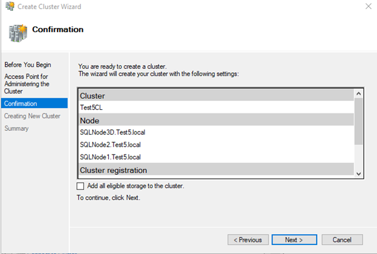
   
10. Cluster creation progress:  

    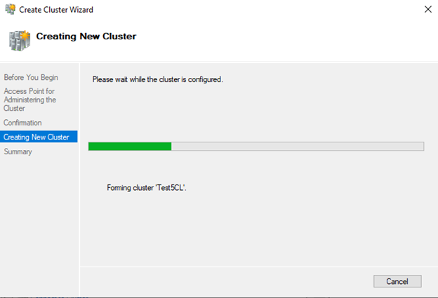
	
11. Completion:  

    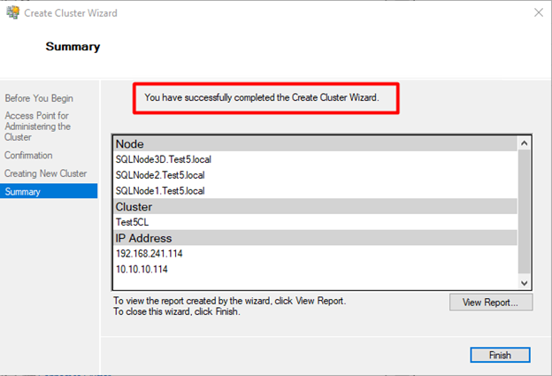

---

## 8. Setting Up the AlwaysOn Availability Group Role for the Cluster 🛡️

1. Begin AG creation:

   
   
2. Availability Group wizard steps:

   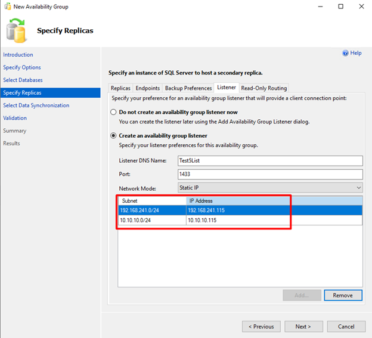

2. In the `New Availability Group` wizard, listener IP addresses for both subnets should be defined:

The rest of the configurations are very similar to single-subnet Availability Group configurations.

---

## 9. Conclusion and Notable Points vs Single-Subnet AG 🧾

After joining secondary subnet servers to the domain, the cluster and AlwaysOn AG can be created normally with these multi-subnet concepts:

* When setting the IP for the cluster, you must set an IP for each subnet (two IPs total). Only one of these IP addresses can be online at a time.
* When setting up a listener for the AG, specify a listener IP for each subnet (two IPs total). Only one listener IP is online at a time per cluster state.

---

# 📎 Appendix

## 1. Some Details About the Cluster and Listener Behaviors 🔍

We know that the primary server holds the IP of the listener on its interfaces—calling the listener’s IP address on the network results in the **primary server responding**.

`ipconfig` on the primary server (example):

| Listener: |
|-----------|

/1736794588382.png)

Cluster IP may be assigned to an interface of one of the servers (often primary, but not necessarily). Example of a same-subnet secondary replica holding cluster IP:

| Cluster: |
|----------|

/1736794690093.png)

The cluster and listener each have 2 IP addresses. When the primary is on subnet `241`, the secondary subnet listener IP is offline:

/1736795622794.png)

After failover to the second subnet:

/1736795651979.png)

> The cluster is reluctant to change its IP address or host solely by failover if a healthy node remains in the original subnet. Example: primary moved Node1 → Node3, cluster IP remained on Node2.

When all nodes on the primary subnet failed, the cluster IP also switched:

/1736795688921.png)

/1736795697520.png)

> Both cluster and listener can only be online on 1 subnet at a time. To serve applications transparently, you may require IP forwarding or dynamic connection string handling.

Failover example when Node1 & Node2 failed:

/1736795744514.png)

The interface of Node3 shows 3 IP addresses above.

---

## 2. Testing the Availability Group 🧪

Logically there is no difference between any nodes in this cluster regarding roles (`primary`, `synchronous`, `asynchronous`, `automatic failover`, etc.).

| Secondary Subnet Node: |
|------------------------|

/1736795855762.png)

All failover scenarios were tested (automatic failover, manual failover, forced failover to secondary subnet node, etc.).

---

**END** 