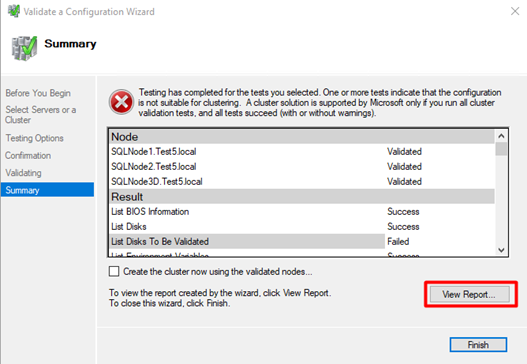
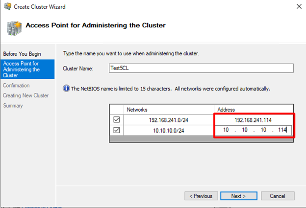

| **192.168.241.111** |
| ------------------------- |

| **192.168.241.112** |
| ------------------------- |

| **10.10.10.113** |
| ---------------------- |

**3.

**

**4.

**

**5.

**

**6.

**

A warning shows up:

Storage validation is unimportant to us right now.

This warning strongly recommends that the
link between our nodes is highly available and fault tolerant. We disregard it
for our test case.

**7.

**

**8.
**Entering cluster IP
addresses for both subnets. Windows server failover cluster’s “Create Cluster Wizard”
automatically detects that your cluster is multi-subnet based on the nodes you
have added.

If multiple subnets exist, all the subnets will be listed
here.

**9.

**

**10.  **

**11.  **

## Setting up the AlwaysOn Availability group role for the cluster:

**1.

**

**2.

2. In the “New Availability Group” wizard, listener IP addresses for both subnets should be
defined:

The rest of the configurations are very similar to single-subnet

Availability Group configurations.

·
**Conclusion and notable points in contrast with the
single-subnet Availability Group:**

After joining the secondary subnet servers to the domain,
the cluster and AlwaysOn AG can be created as normal with the following new
concepts:

When setting the IP for the
cluster, you have to set an IP for each subnet (Overall 2 IPs). The
functionality of these IPs has been explained in the “Some details about the
cluster and listener behaviors” section. As noted, only one of these two IP
addresses can be online at the same time in the cluster.

When setting up a listener
for the AG, you have to specify a listener IP for each subnet (Overall 2 IPs).
As noted, only one of these two IP addresses can be online at the same time in
the cluster.
