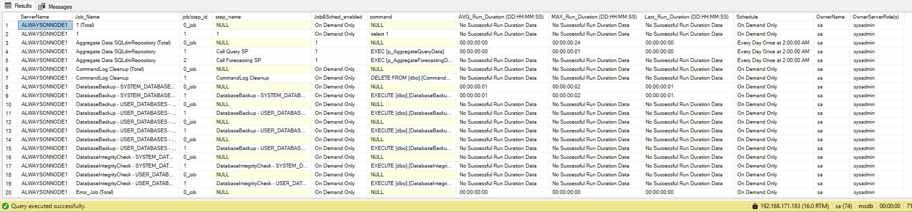
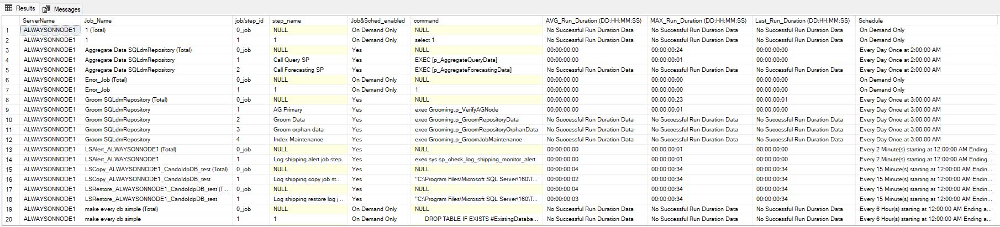
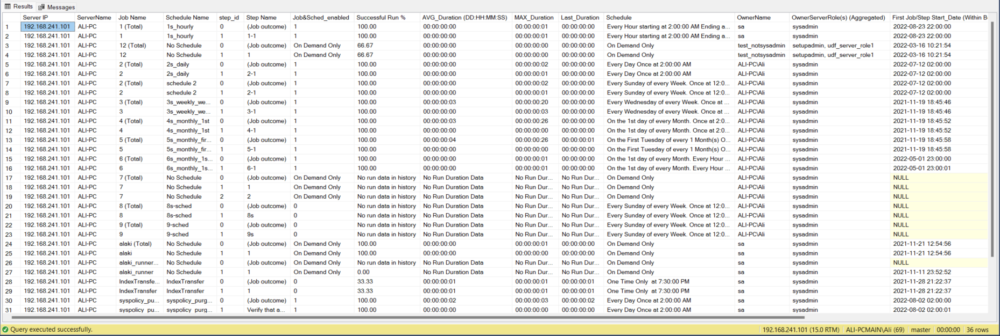

![MS SQL Server](https://img.shields.io/badge/MS%20SQL%20Server-blue?logo=data:image/svg+xml;base64,PD94bWwgdmVyc2lvbj0iMS4wIiBlbmNvZGluZz0iVVRGLTgiPz4KPHN2ZyB2ZXJzaW9uPSIxLjEiIHhtbG5zPSJodHRwOi8vd3d3LnczLm9yZy8yMDAwL3N2ZyIgd2lkdGg9IjIwIiBoZWlnaHQ9IjIyIj4KPHBhdGggZD0iTTAgMCBDMC42NiAwLjk5IDEuMzIgMS45OCAyIDMgQzQuMDQyODUxMiAzLjg2NDc2NTIzIDYuMDkyMDA1MzYgNC40NDU5ODM0NiA4LjIyMjY1NjI1IDUuMDU4NTkzNzUgQzEwIDYgMTAgNiAxMC43NDYwOTM3NSA4LjA5NzY1NjI1IEMxMC44NzE3NzczNCA5LjAzOTMxNjQxIDEwLjg3MTc3NzM0IDkuMDM5MzE2NDEgMTEgMTAgQzguNjkgMTAuMzMgNi4zOCAxMC42NiA0IDExIEMzLjkzOTQxNDA2IDExLjYyNjQ4NDM4IDMuODc4ODI4MTMgMTIuMjUyOTY4NzUgMy44MTY0MDYyNSAxMi44OTg0Mzc1IEMzLjczMjYxNzE5IDEzLjcxNTcwMzEyIDMuNjQ4ODI4MTIgMTQuNTMyOTY4NzUgMy41NjI1IDE1LjM3NSBDMy40ODEyODkwNiAxNi4xODcxMDkzNyAzLjQwMDA3ODEzIDE2Ljk5OTIxODc1IDMuMzE2NDA2MjUgMTcuODM1OTM3NSBDMyAyMCAzIDIwIDIgMjIgQy01LjQyODU3MTQzIDIyLjI4NTcxNDI5IC01LjQyODU3MTQzIDIyLjI4NTcxNDI5IC05IDIwIEMtOS4zMTI1IDE3LjgxMjUgLTkuMzEyNSAxNy44MTI1IC05IDE1IEMtNy43MzE1NjI1IDEzLjc2MjUgLTcuNzMxNTYyNSAxMy43NjI1IC02LjQzNzUgMTIuNSBDLTUuNjMzMTI1IDExLjY3NSAtNC44Mjg3NSAxMC44NSAtNCAxMCBDLTQuMDAxNTYyMjQgNy40MDg4MjY4NyAtNC4wMDE1NjIyNCA3LjQwODgyNjg3IC01IDUgQy01LjE4NTYyNSA0LjIzNjg3NSAtNS4zNzEyNSAzLjQ3Mzc1IC01LjU2MjUgMi42ODc1IEMtNS43MDY4NzUgMi4xMzA2MjUgLTUuODUxMjUgMS41NzM3NSAtNiAxIEMtNCAwIC00IDAgMCAwIFogIiBmaWxsPSIjOUQ0MzQyIiB0cmFuc2Zvcm09InRyYW5zbGF0ZSg5LDApIi8+CjxwYXRoIGQ9Ik0wIDAgQy0wLjE0MTA3NzQ3IDEuNDU4ODAxMDkgLTAuMjg4MDI0MTUgMi45MTcwMzU1MSAtMC40Mzc1IDQuMzc1IEMtMC41MTg3MTA5NCA1LjE4NzEwOTM3IC0wLjU5OTkyMTg3IDUuOTk5MjE4NzUgLTAuNjgzNTkzNzUgNi44MzU5Mzc1IEMtMSA5IC0xIDkgLTIgMTEgQy05LjQyODU3MTQzIDExLjI4NTcxNDI5IC05LjQyODU3MTQzIDExLjI4NTcxNDI5IC0xMyA5IEMtMTMuMDQyNzIxIDcuMzMzODgwOTUgLTEzLjA0MDYzODMyIDUuNjY2MTcxMTUgLTEzIDQgQy0xMi42NyAzLjY3IC0xMi4zNCAzLjM0IC0xMiAzIEMtMTEuMjU3NSAzLjA0MTI1IC0xMC41MTUgMy4wODI1IC05Ljc1IDMuMTI1IEMtNS44NTIzNzE2OCAyLjk0NzgzNTA4IC0zLjcwNTY1NTM0IDAgMCAwIFogIiBmaWxsPSIjOTM5NjlCIiB0cmFuc2Zvcm09InRyYW5zbGF0ZSgxMywxMSkiLz4KPHBhdGggZD0iTTAgMCBDMC42NiAwIDEuMzIgMCAyIDAgQzIuMzMgMS4zMiAyLjY2IDIuNjQgMyA0IEM1LjY0IDQuMzMgOC4yOCA0LjY2IDExIDUgQzEwLjY3IDUuOTkgMTAuMzQgNi45OCAxMCA4IEMyLjU3MTQyODU3IDguMjg1NzE0MjkgMi41NzE0Mjg1NyA4LjI4NTcxNDI5IC0xIDYgQy0xLjA0MjcyMSA0LjMzMzg4MDk1IC0xLjA0MDYzODMyIDIuNjY2MTcxMTUgLTEgMSBDLTAuNjcgMC42NyAtMC4zNCAwLjM0IDAgMCBaICIgZmlsbD0iIzU4NUQ2MCIgdHJhbnNmb3JtPSJ0cmFuc2xhdGUoMSwxNCkiLz4KPHBhdGggZD0iTTAgMCBDMi44NjcyNDY4NiAwLjU3MzQ0OTM3IDMuODYxNDUxNSAwLjg2MTQ1MTUgNiAzIEM1LjY3IDMuNjYgNS4zNCA0LjMyIDUgNSBDNC4wMSA1LjMzIDMuMDIgNS42NiAyIDYgQzEuMzQgNi42NiAwLjY4IDcuMzIgMCA4IEMtMC45OSA3LjM0IC0xLjk4IDYuNjggLTMgNiBDLTIuMDEgNC4wMiAtMS4wMiAyLjA0IDAgMCBaICIgZmlsbD0iIzhCMjgyNiIgdHJhbnNmb3JtPSJ0cmFuc2xhdGUoNiw3KSIvPgo8cGF0aCBkPSJNMCAwIEMyLjY0IDAuMzMgNS4yOCAwLjY2IDggMSBDOC4zMyAyLjMyIDguNjYgMy42NCA5IDUgQzcuMDIgNS4zMyA1LjA0IDUuNjYgMyA2IEMyIDQgMSAyIDAgMCBaICIgZmlsbD0iIzYxMTkxOSIgdHJhbnNmb3JtPSJ0cmFuc2xhdGUoMTEsNSkiLz4KPHBhdGggZD0iTTAgMCBDMCAxLjk4IDAgMy45NiAwIDYgQy0xLjY1IDYuMzMgLTMuMyA2LjY2IC01IDcgQy00LjgxNDM3NSA2LjM4MTI1IC00LjYyODc1IDUuNzYyNSAtNC40Mzc1IDUuMTI1IEMtMy43NjMxMzgyNCAyLjk1ODM5ODIyIC0zLjc2MzEzODI0IDIuOTU4Mzk4MjIgLTUgMSBDLTIgMCAtMiAwIDAgMCBaICIgZmlsbD0iIzczNzQ3NCIgdHJhbnNmb3JtPSJ0cmFuc2xhdGUoMTMsMTEpIi8+CjxwYXRoIGQ9Ik0wIDAgQzAuNjYgMCAxLjMyIDAgMiAwIEMyIDEuOTggMiAzLjk2IDIgNiBDMi42NiA2LjMzIDMuMzIgNi42NiA0IDcgQzIuMzUgNi42NyAwLjcgNi4zNCAtMSA2IEMtMS4wNDI3MjEgNC4zMzM4ODA5NSAtMS4wNDA2MzgzMiAyLjY2NjE3MTE1IC0xIDEgQy0wLjY3IDAuNjcgLTAuMzQgMC4zNCAwIDAgWiAiIGZpbGw9IiM2NzYwNjciIHRyYW5zZm9ybT0idHJhbnNsYXRlKDEsMTQpIi8+Cjwvc3ZnPgo=&labelColor=white) 


## Hit the Star! :star:

If this repo helps, please hit the star. Thanks!

<br/>


<br/>


* These are an RDBMS DBA's major responsibilities:

1. Installation, Configuration, Provisioning, and Capacity Planning
2. Data Safeguarding, Backup and Recovery
3. High Availability and Disaster Recovery
4. Performance Tuning and Query Optimization
5. Schema Design and Data Modeling
6. Change Management and Migrations
7. Security and Compliance, Auditing
8. Monitoring and Alerting
9. Maintenance, Housekeeping, Automation, and Scripting
10. Troubleshooting and Incident Response


# 📚 SQL Server DBA Tools – Curated `T-SQL` Scripts Collection

> A practical toolbox of `T-SQL` scripts for SQL Server administrators and developers: automation, recovery, migrations, maintenance, auditing, and educational examples.

---

## 1. 🔐 License & Contribution

| Item | Details |
|------|---------|
| License | `CC0-1.0` *(Public Domain Dedication)* |
| Contact | Email: [amomen@gmail.com](mailto:amomen@gmail.com) |
| Issues / Ideas | Open a GitHub issue or email |
| Networking | Connect on LinkedIn: [Ali Momen](https://www.linkedin.com/in/ali-momen) |
| Blog | [https://amdbablog.blogspot.com/](https://amdbablog.blogspot.com/) |
| Stars | ⭐ If useful, please star the repository |

---

## 2. 🧭 General Notes

- These scripts are intended for various purposes. A brief explanation for each comes here. More verbose explanation about the script, if not already now, will be in the script's respective exclusive directory.
- Most scripts target general-purpose `SQL Server` administration tasks.
- Some scripts are intentionally simple (see the `Educational` directory) yet include subtle techniques.
- Naming convention: many stored procedures start with `sp_` (personal preference, and for ease of use to create them in the master database and be able to execute them from any database context); feel free to rename (`usp_` if desired).
- `T-SQL` is not always optimal for extreme workloads; consider native features or offloading when appropriate.
- Some scripts are pending deeper refactoring or extended inline documentation—planned for future improvement.
- Not every script in the repository is yet mentioned in this `README`.

---

## 3. 📑 Table of Contents

1. [sp_restore_latest_backups](#31-sp_restore_latest_backups)
2. [sp_MoveDatabases_Datafiles](#32-sp_movedatabases_datafiles)
3. [sp_JobsInfo](#33-sp_jobsinfo)
4. [Transfer Indexes to Other Filegroups / Partition Schemes](#34-transfer-indexes-to-other-filegroupspartition-schemes)
5. [Upcoming: Dynamic Excel Generation](#35-upcoming-create-automated-dynamically-generated-formatted-and-decorated-excel-xlsx-file-without-ssis)
6. [Execute External T-SQL Scripts](#36-execute-external-tsql)
7. [Enable CDC in AG Cluster (Primary / Secondary)](#37-enable-cdc-on-a-clusters-primary-replica-enable-cdc-on-a-secondary-replica)
8. [dbWarden Scripts](#38-dbwarden-scripts-contained-within-dbwarden-directory)
9. [Backup Website](#39-backup-website-within-t-sql_backuprestore-repo-directory)
10. [Restore Website](#310-restore-website-within-t-sql_backuprestore-repo-directory)
11. [Cardinality Factor Calculator](#311-cardinality-factor-calculator-sp-for-a-table)
12. [Drop Login Dependencies](#312-drop-login-dependencies)
13. [sp_restore_latest_backups_on_other_server (PsExec)](#313-sp_restore_latest_backups_on_other_server-using-psexec)
14. [Correct Checksum of a Corrupt Page](#314-correct-checksum-of-a-corrupt_page-within-educational-directory)
15. [Create DimDate Table](#315-create-dimdate-table-within-bi-directory)
16. [Automated Setup (Configuration + Batch)](#316-typical-sql-server-setup-configuration-file-with-installation-batch-file-within-educational-directory)

---

## 4. 🧰 Contained Scripts

### 3.1 sp_restore_latest_backups

Effortlessly probe recursively for backup files and restore:
- Latest `FULL` or `DIFF` + optional sequence of `LOG` backups.
- To a point-in-time (`@StopAt`) or latest log.
- Across multiple databases (with filtering and inclusion/exclusion lists).
- With options for tail-log backup, read-only conversion, shrinking, file relocation, containment activation, permissions expansion, and compression strategies.

**Applications (Examples):**
1. Automated refresh to development/staging with post-restore operations (recovery model changes, shrinking, read-only, log rebuild).
2. Delegated restore capability for senior developers without direct file share access.
3. Auditable tracking of restore sources, destinations, timestamps, and options.

**Example:**
```tsql
EXEC sp_restore_latest_backups 
      @Destination_Database_Name_suffix = N'_test'
    , @Destination_Database_Name_prefix = N''
    , @Destination_DatabaseName         = N''
    , @Ignore_Existant                  = 0
    , @Destination_Database_DataFiles_Location = 'D:\Database Data'
    , @Destination_Database_LogFile_Location   = 'D:\Database Log'
    , @Backup_root_or_path              = N'D:\Database Backup\'
    , @BackupFileName_naming_convention = N'[{"BackupType":"FUL","NamingConvention":"DBName_BackupType_ServerName_TIMESTAMP.ext","Separator":"_","Transform":"STUFF(STUFF(STUFF(STUFF(TIMESTAMP,5,0,''.''),8,0,''.''),11,0,'' ''),14,0,'':'')+'':00''"}]'
    , @Skip_Files_That_Do_Not_Match_Naming_Convention = 1
    , @Exclude_system_databases         = 1
    , @Exclude_DBName_Filter            = N'  %adventure%,  %DW%'
    , @Include_DBName_Filter            = N''
    , @IncludeSubdirectories            = 1
    , @Restore_Log_Backups              = 1
    , @LogBackup_root_or_path           = N''
    , @StopAt                           = '2022.08.17 20:35:18'
    , @Keep_Database_in_Restoring_State = 0
    , @Take_tail_of_log_backup_of_existing_database = 0
    , @DataFileSeparatorChar            = '_'
    , @Change_Target_RecoveryModel_To   = 'same'
    , @Set_Target_Databases_ReadOnly    = 0
    , @STATS                            = 50
    , @Generate_Statements_Only         = 0
    , @Delete_Backup_File               = 0
    , @Activate_Destination_Database_Containment = 1
    , @Stop_On_Error                    = 0
    , @ShrinkDatabase_policy            = 0
    , @ShrinkLogFile_policy             = -2
    , @RebuildLogFile_policy            = '2MB:64MB:1024MB'
    , @GrantAllPermissions_policy       = -2;
```

---

### 3.2 sp_MoveDatabases_Datafiles

Relocates data and/or log files for one or multiple databases (including `FILESTREAM` / `MEMORY_OPTIMIZED_DATA` / `tempdb` special handling) with minimal downtime.
- Supports batch execution for multiple databases.
- Handles directory creation.
- Allows selective movement (data only / log only).

**Example:**
```tsql
EXEC dbo.sp_MoveDatabases_Datafiles
      @DatabasesToBeMoved      = ''
    , @New_Datafile_Directory  = ''
    , @New_Logfile_Directory   = 'E:\Database Log';
```

---

### 3.3 sp_JobsInfo

Provides:
- Job schedules, frequency, next execution analysis.
- Security insights (job owner’s server role memberships).
- Overlap detection context (manual evaluation).

Two related views:
- `msdb.dbo.v_view_jobs`
- `msdb.dbo.v_view_business_jobs` (extended per-step + historical metrics)

**Example A:**
```tsql
SELECT * FROM msdb.dbo.v_view_jobs;
```

**Example B:**
```tsql
SELECT * FROM msdb.dbo.v_view_business_jobs;
```

Screenshots (referenced in repository):


- `1733013852761.png`



- `1733012910087.png`

Credit for schedule decoding patterns: **Alan Jefferson**  
[Article Link](https://www.sqlservercentral.com/articles/how-to-decipher-sysschedules)

---

### 3.4 Transfer Indexes to Other Filegroups/Partition Schemes

`usp_move_indexes_to_another_filegroup_per_every_database`:
- Generates and executes index relocation statements across databases.
- Supports partition schemes, compression options, online operations, retry logic, and email reporting.

**Example Invocation Pattern:**
```tsql
EXEC dbo.usp_move_indexes_to_another_filegroup_per_every_database
      @DatabaseName
    , @starting_index_id
    , @ending_index_id
    , @target_filegroup_or_partition_scheme_name
    , @SORT_IN_TEMPDB              = 0
    , @STATISTICS_NORECOMPUTE      = 1
    , @STATISTICS_INCREMENTAL      = 0
    , @ONLINE                      = 1
    , @MAXDOP                      = 4
    , @DATA_COMPRESSION            = 'NONE'
    , @DATA_COMPRESSION_PARTITIONS = NULL
    , @FILESTREAM                  = NULL
    , @Retry_With_Less_Options     = 1
    , @Email_Recipients
    , @copy_recipients
    , @blind_copy_recipients
    , @Create_or_Update_IndexTransferResults_Table = 0;
```

---

### 3.5 Upcoming: Create Automated Formatted Excel (`.xlsx`) (No SSIS)

Generates dynamically formatted Excel output (branding, conditional styling, dynamic date stamping) suitable for scheduled export (e.g., email attachments).

**Example (Placeholder):**
```tsql
-- Sample code to be provided in future revision.
```



Sample screenshot: `Screenshot_5.png`

---

### 3.6 Execute External T-SQL

`sp_execute_external_tsql`:
- Executes local or folder-based `.sql` scripts via `sqlcmd` + `xp_cmdshell`.
- Supports:
  - Wildcard or regex filtering
  - Pre/Post commands
  - DAC mode
  - Copy/move handling after success
  - Execution debugging modes
  - Error handling policies

**Example:**
```tsql
EXECUTE master..sp_execute_external_tsql 
      @Change_Directory_To_CD             = ''
    , @InputFiles                         = ''
    , @InputFolder                        = '"C:\Users\Administrator\Desktop\test"'
    , @PreCommand                         = 'exec sp_configure ''show advanced options'',1; reconfigure; exec sp_configure ''cost threshold for parallelism'',25; reconfigure; exec sp_configure ''show advanced options'',0; reconfigure;'
    , @FileName_REGEX_Filter_PowerShell   = '*.sql'
    , @Include_Subdirectories             = 1
    , @Server                             = NULL
    , @AuthenticationType                 = NULL
    , @UserName                           = NULL
    , @Password                           = NULL
    , @DefaultDatabase                    = 'master'
    , @Keep_xp_cmdshell_Enabled           = 1
    , @isDAC                              = 0
    , @Debug_Mode                         = 2
    , @DoNot_Dispaly_Full_Path            = 1
    , @skip_cmdshell_configuration        = 0
    , @Stop_On_Error                      = 0
    , @Show_List_of_Executed_Scripts      = 0
    , @Stop_After_Executing_Script        = ''
    , @After_Successful_Execution_Policy  = 4
    , @MoveTo_Folder_Name                 = 'old';
```

---

### 3.7 Enable CDC on a Cluster (Primary & Secondary Replica)

Scripts in `BI\Enable CDC for clusters`:
- Coordinate enabling `CDC` on AG primary.
- Configure required jobs on secondary via an auxiliary script.
- Automates otherwise error-prone failover considerations.

Execute:  
`Enable CDC for clusters.sql` (specify path to `create CDC Jobs On Secondary.sql` inside it)

---

### 3.8 dbWarden Scripts (Monitoring Suite)

`dbWarden`: free monitoring pack (mostly `T-SQL`).
- Includes:  
  - `CPU intensive tasks for an instance (dbWarden).sql`  
  - `Per Day-Average KPI stat for the last No of days.sql`

Resources:  
- Intro Article: [dbWarden on SQLServerCentral](https://www.sqlservercentral.com/articles/dbwarden-a-free-sql-server-monitoring-package-3)  
- SourceForge: [https://sourceforge.net/projects/dbwarden/](https://sourceforge.net/projects/dbwarden/)

---

### 3.9 Backup Website (Database + Home Folder)

Automates:
- `DBCC CHECKDB`
- `FULL` database backup naming: `DBName_Date_Time.bak`
- File-system home folder packaging (e.g., zipped or copied)
- Suitable for scheduled jobs.

---

### 3.10 Restore Website

Restores website artifacts produced by the backup process:
- Tail-log backup when applicable.
- Maintains database in `RESTORING` during file operations.
- Uses `xp_cmdshell` temporarily (security-managed).
- Supports specifying alternate destination DB name.

> Read the top comments in `Backup_Website.sql` before using this restore script.

---

### 3.11 Cardinality Factor Calculator

Computes:  
`COUNT(DISTINCT column) / COUNT(*)` for each column in a table – helpful for indexing decisions (selectivity heuristics).

**Example:**
```tsql
DECLARE @temp TABLE (Column_Name SYSNAME, [Crowdedness (IN %)] FLOAT);

INSERT INTO @temp
EXECUTE master..CardinalityCalc 'Northwind', 'saasdsad.orders';

SELECT *
FROM @temp
ORDER BY 2 DESC;
```

---

### 3.12 Drop Login Dependencies

`sp_drop_login_dependencies`:
- Disables a login.
- Transfers ownership (DBs, jobs, roles) to safe holders (often `sa` or neutral login).
- Optionally drops login.
- Handles Windows or SQL logins.
- Avoids accidental orphaning (but may still require DB user cleanup).

**Example:**
```tsql
DECLARE @SID VARBINARY(85);

EXEC sp_drop_login_dependencies
      @LoginName        = 'test'
    , @DropLogin        = 1
    , @DroppedLoginSID  = @SID OUTPUT;
```

---

### 3.13 sp_restore_latest_backups_on_other_server (Using PsExec)

Restores latest backups from one server to another using remote execution via `PsExec`:
- Requires: `PsTools` (`psexec.exe`) in system `PATH` on source host.
- Ports required: `TCP 135`, `TCP 445`.
- Optionally supplies remote credentials.

**Example:**
```tsql
EXEC sp_restore_latest_backups_on_other_server
      @Source          = '192.168.241.3'
    , @Destination     = '192.168.241.100'
    , @DestinationUser = 'Ali-PC\Ali'
    , @DestinationPass = 'P@$$W0rd';
```

---

### 3.14 Correct Checksum of a Corrupt Page (Educational)

Demonstrative script to manually correct a page checksum for a known-corrupt page (e.g., identified via `DBCC CHECKDB`).  
Educational only—NOT production best practice.

Sample database: `Northwind`  
Download:  
[Microsoft Sample Databases](https://docs.microsoft.com/en-us/dotnet/framework/data/adonet/sql/linq/downloading-sample-databases)

---

### 3.15 Create DimDate Table (BI)

`Create_DimDate` stored procedure:
- Generates `DimDate` rows across a range.
- Supports multiple cultures (e.g., Persian + Gregorian).
- Builds index (e.g., key on `DateKey_Persian`).
- Optional drop/rebuild if table exists.

**Example:**
```tsql
EXEC dbo.Create_DimDate
      @StartDate_Gregorian          = '19900101'
    , @EndDate_Gregorian            = '20401231'
    , @Drop_Last_DimDate_If_Exists  = 1;
```

---

### 3.16 Typical SQL Server Setup (Automated Silent Install)

Batch + `.ini` + helper `T-SQL` scripts orchestrate:
- ISO mount
- Engine install (unattended)
- `SSMS` install (silent)
- Cumulative Update application
- SQLCMD installation
- Firewall + port configuration
- Rename `sa`
- Restore baseline databases (`dbWarden`, `master`)
- System restart (conditional)

**Batch Execution Example:**
```batch
rem For argument descriptions refer to the readme inside the setup folder.
"\\Server\c$\Users\a.momen\Directory\Install SQL Server.cmd" H $@PA$$W0RD 2 #####-#####-#####-#####-##### 4
```

**Prerequisite Artifacts (Provide or Remove References):**
- `dbWarden_DB1_truncated_22.05.31.bak`
- `MsSqlCmdLnUtils.msi`
- `SQLADDB_22.06.06.bak`
- `SSMS` installer
- `dbWarden-Jobs.sql`

**Notes:**
- Run batch as Administrator.
- Adjust port if not changing the default.
- Read `readme.txt` in `SQL Server Unattended (Silent) Installation` directory.

---

## 5. 🛠️ Operational Best Practices

| Area | Recommendation |
|------|---------------|
| Security | Limit elevated role ownership for agent jobs. |
| Recovery | Test restore scripts periodically. |
| Maintenance | Schedule index moves off-peak. |
| Logging | Capture output of long-running automation. |
| Source Control | Version scripts with semantic tags (e.g., `v1.4-sp_restore`). |

---

## 6. 📊 Suggested Usage Flow

1. **Environment Refresh:** Run `sp_restore_latest_backups`.
2. **File Relocation:** Use `sp_MoveDatabases_Datafiles`.
3. **Security Audit:** Run login dependency & job info scripts.
4. **Index Maintenance:** Apply index transfer script (with logging).
5. **Metadata Governance:** Capture routine + cardinality metrics.
6. **Automation:** Deploy external script executor for patch pipelines.

---

## 7. 🧪 Validation Checklist

| Check | Script |
|-------|--------|
| Backup Restore Validated | `sp_restore_latest_backups` |
| Log Shipping/CDC unaffected | CDC scripts |
| Security Regression | Job owner & login dependency scripts |
| Index Moves Completed | Index transfer SP |
| Date Dimension Integrity | `Create_DimDate` |

---

## 8. 🚀 Roadmap (Planned Enhancements)

- Add `Query Store` insight extraction.
- Add `Availability Group` failover test harness.
- Extend `Excel` generation to multi-sheet dashboards.
- Introduce `Permissions Drift` detector.
- Add `Blocking / Latch Analysis` scripted snapshots.

---

## 9. 🧾 Glossary

| Term | Meaning |
|------|--------|
| `TAIL LOG` | Last log backup before restore overwrite. |
| `Containment` | Database-level isolation of metadata/security. |
| `PsExec` | Sysinternals tool for remote execution. |
| `CDC` | Change Data Capture feature. |
| `DAC` | Dedicated Admin Connection. |
| `Selectivity` | Distinctness ratio guiding index design. |

---

## 10. ⚠️ Disclaimers

- Some operations (checksum manipulation, forced log rebuild, PsExec remote restores) are advanced—test in isolated environments first.
- `xp_cmdshell` usage is controlled but must be reviewed by security teams.
- Tail-log skipping may risk data loss if not used appropriately.

---

## 11. ✅ Quick Status Review

| Area | Status |
|------|--------|
| Core Restore Automation | ✔ Stable |
| Index Mobility | ✔ Functional |
| External Script Executor | ✔ Enhanced |
| Excel Automation | ⏳ In Progress |
| Documentation Coverage | 🔄 Expanding |

---

## 12. 🙏 Appreciation

If these `scripts` help:
- ⭐ Star the repo
- 📨 Share feedback
- 🔁 Contribute improvements

---

**End of Document** ✨
