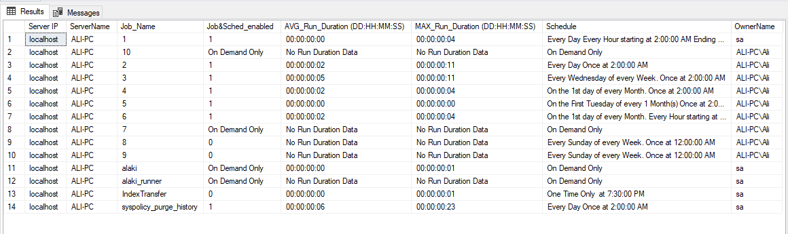

# \#SQLServer
T-SQL Scripts


- License: Do whatever you wish with these files!!! :smile::laughing: Just please include the Author tag and do not use them commercially without consent.
If you wish to contribute to the codes or have any suggestions or want to report a flaw,
please give me an email at amomen@gmail.com
These scripts are for SQL Server's general purposes. For full corresponding instructions for each script,
please refer to the README.md file included in its folder.
- The scripts are not pretty much optimized where they don't need to be.
- I will gladly write scripts for you if you wish.
- Please have a look at my website if you wish at https://amdbablog.blogspot.com/

## Contained Scripts
  <br/>
<dl>
  
<dt>1. Backup Website (Within T-SQL_Backup&Restore repo directory):</dt>
  <br/>  	
<dd>This script performs a full backup of the database and home folder files of the intended website. It can be turned into a
scheduled job to run at specific schedules. The DB backup file name will be in 'DBName_Date_Time + .bak' format.
The home folder backup has a similar name. A checkdb will also be performed prior to the database backup. </dd>


<dt>2. Restore Website (Within T-SQL_Backup&Restore repo directory):</dt>
  <br/>
<dd>
  Before using this script, please read the comments at the beginning of Backup_Website.sql script thoroughly.
  This script restores the backups performed by the Backup_Website.sql script. You can also specify the destination
  database. If you don't specify the destination database, the database will be restored on its own. This script
  probes inside the backup folder and extracts and restores the latest backup. If the database is to be restored
  on its own, a tail of log backup will be taken first, if the database does not have SIMPLE or Pseudosimple
  recovery model. For the files restore, it overwrites all the files in the destination. By default, the last 
  backup set will be restored, by probing into the backups directory and ignoring the history records of SQL Server
  msdb database. But you can specify the backup location manually. The names are case-insensitive. As the restore
  of Website files is normally time-consuming, the database will be kept in restoring state until the whole script
  is completed. For security reasons, the script enables the extended stored procedure xp_cmdshell
  and disables it again immediately once the procedure is finished executing.
</dd>


<dt>3. Execute external tsql</dt>
  <br/>

<dd>
  This script executes external tsql file(s) using sqlcmd and xp_cmdshell. As :r is only available in SSMS and it requires turning the
  SQLCMD mode on, it can execute external tsql files without SSMS. It can also run all the tsql files contained within a folder and its
  subdirectories. Sample sp execution statement is as follows:
</dd>  
<dd><b>Example:</b></dd>
</dl>

```
  EXECUTE master..execute_external_tsql @InputFiles = N'"C:\Users\Ali\Dropbox\learning\SQL SERVER\InstNwnd.sql"' -- Delimited by a semicolon (;), 
  executed by given order, enter the files which their path contains space within double quotations. Relative paths must be relative to %systemroot%\system32
                                     ,@InputFolder = ''	-- This sp executes every *.sql script that finds within the specified folder path. Quote addresses that contain
                                                        --space within double quotations.
                                     ,@Server = NULL
                                     ,@AuthenticationType = NULL -- any value which does not include the word 'sql' means Windows Authentication
                                     ,@UserName = NULL
                                     ,@Password = NULL
                                     ,@DefaultDatabase = NULL
                                     ,@Keep_xp_cmdshell_Enabled = 0
                                     ,@isDAC = 0	-- run files with Dedicated Admin Connection
```
<dl>

<dt>4. Cardinality Factor calculator sp for a table</dt>
  <br/>
<dd>
  This stored procedure takes the name of a database and its table and calculates cardinality factor by calculating count(distinct column)/count(*)
  for every column. This may help the tuning experts choose the better candidate column for indexing.
</dd>  
  <dd><b>Example:</b></dd>
</dl>


```  
    DECLARE @temp TABLE(Column_Name SYSNAME, [Crowdedness (IN %)] FLOAT)
    INSERT INTO @temp
    EXECUTE master..CardinalityCalc 'Northwind','saasdsad.orders'

    select * from @temp
    order by 2 desc
```
<dl>
<dt>5. Drop login dependencies</dt>
  <br/>
<dd>
  This stored procedure disables a login and revokes any dependecies (that prevent the login from being dropped) on the server 
  for that login. Generally, dropping a login in SQL Server is not recommended but there is an option to drop the login at the 
  end of the process. It may also leave orphaned database users. If the login is windows authentication, you do not have to specify
  the domain or computer name unless there are several identical login names under different domain and computer names. The complete
  windows authentication login name must be in the format: DomainName\LoginName (LoginName@DomainName format is not supported).
  For transferring the dependencies, security best practices are observed, that means the ownership of databases and user defined server
  roles will be transfered to holder of 0x01 SID (login name 'sa' by default) and the ownership of jobs will be transferred to a new
  login with no specific access.
	</dd>  
  <dd><b>Example:</b></dd>
</dl>

```  
    DECLARE @SID VARBINARY(85)
    EXEC sp_drop_login_dependencies @LoginName = 'test'
                               ,@DropLogin = 1
                               ,@DroppedLoginSID = @SID OUTPUT
```                               
	
<dl>
<dt>6. sp_restore_latest_backups_on_other_server (using psexec)</dt>
  <br/>
<dd>
  The idea of this script comes from my SQL Server professor P.Aghasadeghi (http://fad.ir/Teacher/Details/10). This stored procedure
  restores the latest backups of a server on another server. Can come in handy sometimes. Please note that this SP benefits from
  Mark Russinovich's PsTools (psexec executable) briefly introduced on Microsoft's website at https://docs.microsoft.com/en-us/sysinternals/downloads/pstools
  and is mandatory for this script. After downloading PsTools, please place psexec from its archive to the source server's path. You can add it to a folder
  which is already in path like %systemroot%\system32\. There is no requirement for psexec on the destination server except for availability of the ports tcp\135
  and tcp\445 which are open by default in Windows Firewall.
</dd>  
  <dd><b>Example:</b></dd>
</dl>

```  
  exec sp_restore_latest_backups_on_other_server
	@Source = '192.168.241.3',					-- IPv4, IPv6, or hostname
	@Destination = '192.168.241.100',				-- IPv4, IPv6, or hostname
	@DestinationUser = 'Ali-PC\Ali',				-- Leave user and pass empty if on a domain, and source's SQL Server service account 
									-- must be an administrator on the target machine, Otherwise specify a username
									-- and password of an administrator of the target machine. Provide the username
									-- in full [Domain or Computer name\username] format. The destination user must
									-- also be a windows login and authorized to restore backups on the target SQL Server
	@DestinationPass = 'P@$$W0rd'
```
<dl>
<dt>7. sp_restore_latest_backups</dt>
  <br/>
	<dd> </dd>
	<dd>
	The idea of this script comes from my SQL Server professor P.Aghasadeghi (http://fad.ir/Teacher/Details/10). This stored procedure
  	restores the latest backups from backup files accessible to the server. As the server is not the original producer of these backups,
	there will be no records of these backups in msdb. The records can be imported from the original server anyways but there would be
	some complications. This script probes recursively inside the provided directory, extracts all the full or read-write backup files,
	reads the database name and backup finish dates from these files and restores the latest backup of every found database. If the
	database already exists, a tail of log backup can be taken optionally first.
	</dd>
	<dd> </dd>
	<dd><b>Example:</b></dd>
	<dd> </dd>
</dl>

```
exec sp_restore_latest_backups 

	@Drop_Database_if_Exists = 0,
					-- Turning this feature on is not recommended because 'replace' option of the restore command, transactionally drops the
					-- existing database first and then restores the backup. That means if restore fails, drop also will not commit, a procedure
					-- which cannot be implemented by the tsql programmer (alter database, drop database, restore database commands cannot be put into a user
					-- transaction). But if you want a clean restore (Currently I don't know what the difference between 'restore with replace' and 'drop and restore'
					-- is except for what i said which is an advantage of 'restore with replace'), set this parameter to 1, however it's risky and not
					-- recommended because if the restore operation fails, the drop operation cannot be reverted and you will lose the existing database. If you
					-- don't set this parameter to 1, the 'replace' option of the restore command will be used anyway. 
					-- Note: if you want to use this parameter only to relocate database files 'replace' command does this for you and you don't need to use this
					-- parameter. Generally, use this parameter as a last resort on a manual execution basis.

	@Destination_Database_Name_suffix = N'',
					-- You can specify the destination database names' suffix here. If the destination database name is equal to the backup database name,
					-- the database will be restored on its own. Leave empty to do so.
	@Destination_Database_DataFiles_Location = 'same',			
					-- This script creates the folders if they do not exist automatically. Make sure SQL Service has permission to create such folders
					-- This variable must be in the form of for example 'D:\Program Files\Microsoft SQL Server\MSSQL15.MSSQLSERVER\DATA'. If left empty,
					-- the datafiles will be restored to destination servers default directory. If given 'same', the script will try to put datafiles to
					-- exactly the same path as the original server. One of the situations that you can benefit from this, is if your destination server
					-- has an identical structure as your original server, for example it's a clone of it.
					-- if this parameter is set to same, the '@Destination_Database_LogFile_Location' parameter will be ignored.
					-- Setting this variable to 'same' also means forcing @Drop_Database_if_Exists to 1
					-- Possible options: 'SAME'|''. '' or NULL means target server's default
	@Destination_Database_LogFile_Location = 'D:\test\testLog',	
					-- if @Destination_Database_DataFiles_Location parameter is set to same, the '@Destination_Database_LogFile_Location' parameter will be ignored.
	@Backup_root = N'e:\TestBackup',		
					-- Root location for backup files.
	@IncludeSubdirectories = 1,
					-- Choose whether to include subdirectories or not while the script is searching for backup files.
	@Keep_Database_in_Restoring_State = 0,						
					-- If equals to 1, the database will be kept in restoring state
	@Take_tail_of_log_backup = 0,
																
	@DataFileSeparatorChar = '_',		
					-- This parameter specifies the punctuation mark used in data files names. For example "_"
					-- in 'NW_sales_1.ndf' or "$" in 'NW_sales$1.ndf'.
	@Change_Target_RecoveryModel_To = 'simple',
					-- Set this variable for the target databases' recovery model. Possible options: FULL|BULK-LOGGED|SIMPLE|SAME
					-- If the chosen option is simple, the log file will also shrink
	@Set_Target_Databases_ReadOnly = 1,
	@Delete_Backup_File = 0
					-- Turn this feature on to delete the backup files that are successfully restored.
```
	

<dl>
<dt>8. Job duration and schedules:</dt>
	<dd> </dd>
	<dd>
This script reports some information about jobs and their schedules. A sample output of this script is as follows. It is not
optimized though because no optimization would be necessary. Part of the script (first function and the body of second function
has been taken from the following URL written by <b>Alan Jefferson</b>:</dd>	
	
https://www.sqlservercentral.com/articles/how-to-decipher-sysschedules
<p> </p>  
<dd>	
It helps DBAs plan their jobs' time table to smartly set their schedules to carry out necessary practices. For example, overlapping
jobs should generally be avoided:
</dd>
<p> </p>	
	


</dl>
  <br/>
<p> </p>
<dl>
<dt> 9. correct checksum of a corrupt_page:</dt>
<dd>
If you have a corrupt page within your database and have identified it through some means, for example "DBCC CHECKDB('DBNAME')",
you can make the page readable/writable again, by ordinary SQL statements, by correcting the checksum at a low level. This script
is an example of it on the "Northwind" database. This script is included inside "Educational" subdirectory of the repository.
</dd>
</dl>	


<!-- <table style="border:none;">
  <tr>
    <th>ID</th><th>Name</th><th>Rank</th>
  </tr>
  <tr>
    <td>1</td><td>Tom Preston-Werner</td><td>Awesome</td>
  </tr>
  <tr>
    <td>2</td><td>Albert Einstein</td><td>Nearly as awesome</td>
  </tr>
</table> -->

<!-- <dl>
  <dt>Lower cost</dt>
  <dd>The new version of this product costs significantly less than the previous one!</dd>
  <dt>Easier to use</dt>
  <dd>We've changed the product so that it's much easier to use!</dd>
</dl>
 -->
